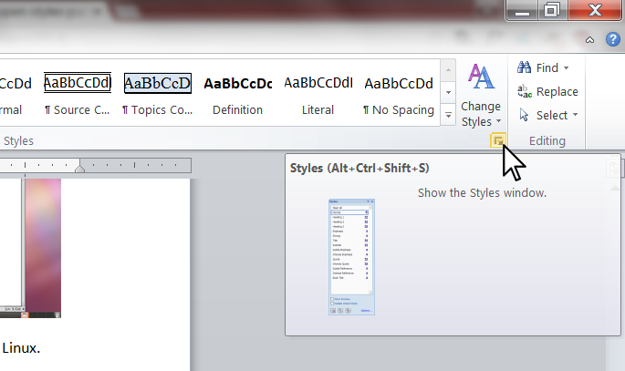

# invent-with-python-3rd-french
The French translation of the 3rd edition of "Invent Your Own Computer Games with Python"

Thank you to all translators. You are making the world of programming accessible to all! The Spanish translation is the first to be completed and is now free to read online ( http://inventwithpython.com/es/ ) and purchase online ( http://www.amazon.com/Inventa-propios-juegos-computadora-Spanish/dp/1514370921/ ). All proceeds are donated to the Python Software Foundation.

Translating
===========

Contact al@inventwithpython.com for more details. I will try to post as much information to make translating as easy as possible.

The .docx files in this repo start as copies of the English chapters. It is these files that are modified as you translate the text.

To translate, clone this repo, make changes to the **.docx** files using Word, Open Office, or Libre Office. These files will also need to use the styles in these files. See "Style" section below.

The .txt files are simply previously translated work. These files are meant to be read-only. Do not create your own .txt files, but instead modify the .docx files directly.

It is highly advisable that you talk to al@inventwithpython.com first before starting translation, just so that you don't repeat someone else's work. Also, make frequent check-ins as you translate. This will prevent someone else from starting to translate the same chapter as you and duplicating work.

Style
=====

For the Spanish translation of the Invent with Python, the translators would type translations into .txt files and I (Al Sweigart) would copy & paste them into Word and do the formatting. This was a mistake and resulted in slow, duplicated work. It would be much more efficient for translators to work with the Word files directly.

But this means translators will have to learn a little about Word's Styles. (Note, when I say "Microsoft Word" in this document, the same also applies to Libre Office or Open Office.)

One thing to note: Do not simple click on the "B" or "I" buttons to make bold and italic. Instead you will always highlight text in Word and select a style (such as Strong and Emphasis)

The .docx Word files in this repo are copies of the English files, and already have all the correct styles applied to them. You can apply the same styles to your translated text. (You can decide when to copy or not copy which styles are used, based on what makes sense for the translated language.)

To open the Styles pane in Word, press Ctrl-Alt-Shift-S. Or, click on the Home menu item and then click the button in the lower right corner of the Styles area, like in this screenshot:

This will open the Styles pane. The style highlighted in the Styles pane is the current style of the text where the cursor is. You can highlight text and change it's style by clicking on a different style in the Styles pane.

For example, if you want to change some text to be bold (that is, the Strong style), you want to:

* Highlight the text to be bolded.
* Open the Styles pane with Ctrl-Alt-Shift-S (if it is not already open).
* Click the Strong style.

To repeat: You will never click the "B" bold or "I" italic, nor change the font size and color directly. You will only apply styles to text. This helps keep all the text in a consistent look.

Some styles are Paragraph styles, and they'll be applied to an entire paragraph of text. (A paragraph in Word ends when you press Enter.) Others are Character styles, which can be applied to individual characters or words (that is, less than a full paragraph). Some are "linked" styles which can be used for both paragraphs and characters. The icon next to the style's name in the Styles pane tells you what kind of style it is.

Here is a description of the Styles used:

* Body - The default style for text. 99% of the text in the documents are in the Body style.
* Code Example - For source code that is not the chapter's feature program. This is when Python code is given as an example in the book. It has a dashed outline.
* Important Note - Used for boxes with solid line borders that contain important information for the reader.
* Normal - This style is not used. It is Word's default style. Use the Body style instead.
* Literal - Used for inline code in the text, such as function or variable names. If Python code appears inside of a paragraph of text, use Literal style to give it a monospace format.
* Definition - Used for technical terms the first time they appear in the text. These words are bolded and use a sans-serif font.
* Source Code - The styles used for the chapter's featured Python program's code. This has a double-line border.
* Source Line Number - Used for the line number characters that begin each line in the featured program's Python code. It is the "42. " at the start of line 42 of a program.
* URL - Used for any websites, which will begin with "http://" or "https://"
* Heading 1 - The style used for the chapter's name. (The Heading styles are used for generating the Table of Contents.)
* Heading 2 - The style used for section headings.
* Heading 3 - The style used for sub-section headings.
* Non-TOC Heading 3 - The style used for sub-section headings, but for subsections not important enough to appear in the Table of Contents.
* Emphasis - Used for italicized text.
* Strong - Used for bolded text.
* List Paragraph - Used for bullet point text.